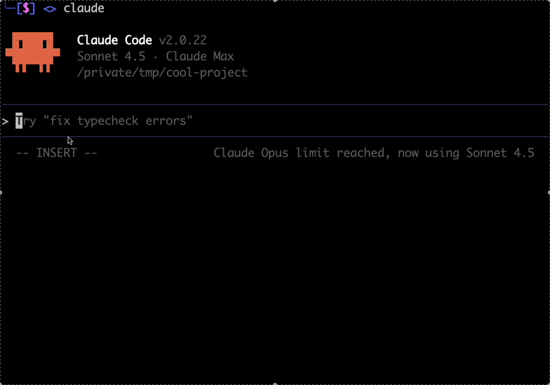
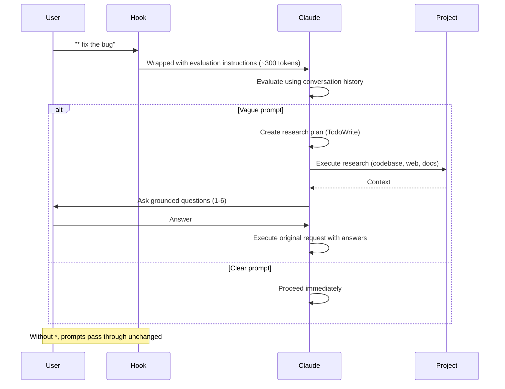

# Claude Code Prompt Improver

An opt-in UserPromptSubmit hook that enriches vague prompts before Claude Code executes them. Triggered with `*` prefix. Uses the AskUserQuestion tool (Claude Code 2.0.22+) for targeted clarifying questions.



## What It Does

When you prefix your prompt with `*`, it wraps it with evaluation instructions. Claude then:
- Checks if the prompt is clear using conversation history
- For vague prompts: creates a research plan, gathers context, asks 1-6 grounded questions
- Proceeds with original request using the clarification

**Result:** Better outcomes on the first try, without back-and-forth. **No overhead when not using `*`.**

## How It Works



## Installation

**Requirements:** Claude Code 2.0.22+ (uses AskUserQuestion tool for targeted clarifying questions)

### Manual Installation

**1. Copy the hook:**
```bash
cp scripts/improve-prompt.py ~/.claude/hooks/
chmod +x ~/.claude/hooks/improve-prompt.py
```

**2. Update `~/.claude/settings.json`:**
```json
{
  "hooks": {
    "UserPromptSubmit": [
      {
        "hooks": [
          {
            "type": "command",
            "command": "python3 ~/.claude/hooks/improve-prompt.py"
          }
        ]
      }
    ]
  }
}
```

> **Note:** Plugin installation is not currently supported due to a bug where UserPromptSubmit hooks from plugins match but never execute ([#10225](https://github.com/anthropics/claude-code/issues/10225)). Manual installation via `settings.json` is the only working method.

## Usage

**Normal use (evaluation disabled by default):**
```bash
claude "fix the bug"      # Passes through without evaluation
claude "add tests"        # Passes through without evaluation
```

**Explicit evaluation trigger:**
```bash
claude "* fix the bug"    # * = trigger evaluation, may ask questions
claude "* add tests"      # * = trigger evaluation, may ask questions
```

**Other bypass prefixes:**
```bash
claude "/help"                              # / = slash commands bypass
claude "# remember to use rg over grep"     # # = memorize bypass
```

**Example: Vague prompt with evaluation:**
```bash
$ claude "* fix the error"
```

Claude asks:
```
Which error needs fixing?
  ○ TypeError in src/components/Map.tsx (recent change)
  ○ API timeout in src/services/osmService.ts
  ○ Other (paste error message)
```

You select an option, Claude proceeds with full context.

**Example: Clear prompt with evaluation:**
```bash
$ claude "* Fix TypeError in src/components/Map.tsx line 127 where mapboxgl.Map constructor is missing container option"
```

Claude proceeds immediately without questions.

## Design Philosophy

- **Opt-in by default** - Evaluation only happens when you explicitly use `*`
- **Trust user intent** - Only ask when genuinely unclear
- **Use conversation history** - Avoid redundant exploration
- **Max 1-6 questions** - Enough for complex scenarios, still focused
- **Transparent** - Evaluation visible in conversation

## Architecture

**Hook (improve-prompt.py):**
- Intercepts via stdin/stdout JSON
- Passes through by default (no evaluation)
- Triggers evaluation only with `*` prefix (removes `*` and wraps prompt)
- Always bypasses: `/` (slash commands), `#` (memorize)

**Main Claude Session:**
- Evaluates using conversation history first
- For vague prompts: creates dynamic research plan (TodoWrite)
- Executes research using appropriate methods (codebase, web, docs, etc.)
- Asks grounded questions (max 1-6) via AskUserQuestion tool
- Executes original request using the answers

**Why main session (not subagent)?**
- Has conversation history
- No redundant exploration
- More transparent
- More efficient overall

## Token Overhead

- **Without `*` prefix:** 0 tokens (pass-through)
- **With `*` prefix:** ~300 tokens per evaluation
- **30-message session (all with `*`):** ~9k tokens (~4.5% of 200k context)
- **Trade-off:** Pay for evaluation only when you need it

## FAQ

**Does this evaluate all prompts by default?**
No. Evaluation is opt-in via the `*` prefix. All prompts pass through unchanged unless explicitly triggered.

**How do I trigger evaluation?**
Start your prompt with `*`: `claude "* fix the bug"`

**Will it slow me down?**
Only when you explicitly request evaluation with `*`. Without `*`, there's no overhead.

**Will I get bombarded with questions?**
No. Evaluation only happens when you use `*`, and even then it rarely intervenes and asks max 1-6 questions.

**Can I customize behavior?**
It adapts automatically using conversation history, dynamic research planning, and CLAUDE.md.

## License

MIT
